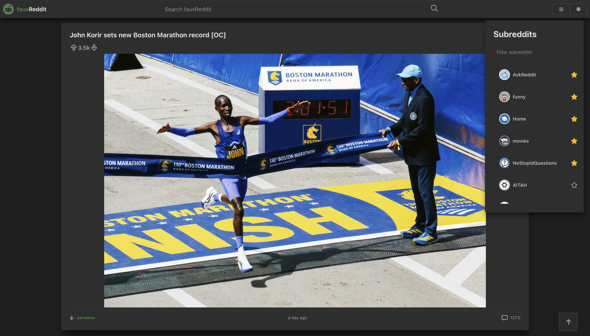

# FauxReddit

A production-hardened Reddit client built with React 18, Redux Toolkit, and Vite, demonstrating modern frontend engineering practices — resilient API integration, defensive rendering, and real-world debugging.



## Table of Contents

- [Tech Stack](#tech-stack)
- [Features](#features)
- [Architecture](#architecture)
- [Key Engineering Decisions](#key-engineering-decisions)
- [What Was Built & Why](#what-was-built--why)
- [Getting Started](#getting-started)
- [Future Improvements](#future-improvements)
- [License](#license)

## Tech Stack

| Technology | Purpose |
|-----------|---------|
| React 18 | UI framework with hooks |
| Redux Toolkit | State management with `createAsyncThunk` |
| Vite | Build tool and dev server |
| Reddit JSON API | Data source |
| Framer Motion | Page transition animations |
| React Loading Skeleton | Loading placeholder states |
| React Markdown | Rendering markdown content in comments |
| ESLint + Prettier | Code quality and formatting |
| Day.js | Lightweight relative time formatting |
| localStorage | Client-side persistence for user preferences |

## Features

- Browse Reddit posts from popular subreddits
- Search for posts across all of Reddit
- View and expand comment threads on any post
- Filter subreddits by name with real-time search
- Star/favorite subreddits — favorites persist across sessions via localStorage and sort to the top
- Dark mode with system-aware toggle (persisted via localStorage)
- Pull-to-refresh on mobile (touch-based with visual indicator)
- Back-to-top button for long feeds
- Responsive layout across mobile, tablet, and desktop
- Animated loading skeletons during data fetches

## Architecture

### Data Flow

```
Reddit JSON API
       ↓
fetchWithRetry (retry with backoff + AbortSignal cancellation)
       ↓
createAsyncThunk (Redux Toolkit)
       ↓
Redux Store (extraReducers: pending → fulfilled / rejected)
       ↓
React Components (useSelector → render)
```

### Project Structure

```
src/
├── api/
│   └── reddit.js              # API layer with fetchWithRetry wrapper
├── components/
│   ├── Card/                  # Reusable card container
│   └── ErrorBoundary/         # Granular error boundary component
├── features/
│   ├── BackToTop/             # Scroll-to-top button
│   ├── Comment/               # Comment rendering with markdown
│   ├── Header/                # Search bar, dark mode, menu toggle
│   ├── Main/                  # Post feed orchestrator
│   ├── Post/                  # Post card + loading skeleton
│   └── Subreddits/            # Sidebar with search + favorites
├── store/
│   ├── index.js               # Store configuration
│   ├── redditslice.js         # Posts/comments state + async thunks
│   └── subredditslice.js      # Subreddits state + favorites + async thunks
└── utils/
    ├── getRandomNumber.js     # Random integer utility
    └── shortenRandomNumber.js # Number formatting (1.2k, 3.4M)
```

## Key Engineering Decisions

### 1. Resilient API Layer with `fetchWithRetry`

All API calls go through a centralized `fetchWithRetry` wrapper that:
- Validates `response.ok` before parsing JSON (prevents opaque `TypeError` crashes)
- Retries once with linear backoff for transient server failures
- Skips retries for 4xx client errors and `AbortError` (no point retrying a cancelled request)
- Propagates structured error objects with HTTP status codes

### 2. `createAsyncThunk` over Manual Thunks

The Redux layer was refactored from hand-written thunks with manual `dispatch(startLoading())` / `dispatch(success(data))` / `dispatch(failed())` patterns to Redux Toolkit's `createAsyncThunk`. This:
- Eliminates boilerplate (no more `startGet*`, `get*Success`, `get*Failed` action creators)
- Provides built-in `AbortController` support via the `signal` parameter — enabling automatic request cancellation when components unmount or new requests supersede old ones
- Uses `extraReducers` with the builder pattern for clear, declarative state transitions

### 3. Granular Error Boundaries

The feed and sidebar are wrapped in an `ErrorBoundary` component so that a crash in one subsystem (e.g., a malformed comment) doesn't white-screen the entire app.

### 4. Scroll Architecture (Header Isolation)

The app uses a flex-based layout where the header sits outside the scroll container. The main content area is the only scrollable element with `overscroll-behavior-y: contain`, which:
- Prevents the browser's native "scroll bounce" from pulling the header
- Enables a custom pull-to-refresh gesture on mobile
- Keeps the `BackToTopButton` scoped to the content scroll position

### 5. Subreddit Favorites with localStorage Persistence

Favorites are stored in Redux state and synced to `localStorage` on every toggle. On app init, the slice reads from `localStorage` to restore the user's selections. A memoized `createSelector` filters subreddits by search term and sorts favorites to the top — all derived, no redundant state.

## What Was Built & Why

This project was intentionally structured to demonstrate skills aligned with a production engineering role focused on debugging, maintenance, and system understanding:

| What | Why |
|------|-----|
| Identified and fixed silent Redux failures (phantom exports, typo in action name) | Demonstrates root-cause debugging, not just symptom-fixing |
| Built `fetchWithRetry` with retry + cancellation | Shows understanding of real-world network failure modes |
| Migrated manual thunks → `createAsyncThunk` | Reduces boilerplate, leverages framework conventions |
| Added `AbortController` cancellation on unmount | Prevents race conditions and memory leaks |
| Migrated Create React App → Vite | Modern tooling fluency, faster development feedback loop |
| Added Error Boundary isolation | Production resilience — partial failures don't crash the whole app |
| Built pull-to-refresh from touch events | Native-feeling mobile UX without a library dependency |
| Persisted favorites in localStorage | Client-side state persistence pattern |
| Capped image heights with `max-height: 80vh` | UX improvement — prevents oversized images from dominating the feed |

## Getting Started

### Prerequisites

- Node.js 18+
- npm

### Installation

```bash
git clone https://github.com/YOUR_USERNAME/fauxreddit.git
cd fauxreddit
npm install
```

### Development

```bash
npm run dev        # Start Vite dev server on port 3000
```

### Production Build

```bash
npm run build      # Output to build/
npm run preview    # Preview the production build locally
```

### Code Quality

```bash
npm run lint       # Run ESLint
npm run format     # Run Prettier
```

## Future Improvements

- [ ] Incremental TypeScript migration (starting with API layer and Redux slices)
- [ ] Unit tests for reducers and API utilities
- [ ] Integration tests for post feed rendering
- [ ] Infinite scroll / pagination for long feeds
- [ ] URL-based routing with React Router
- [ ] Virtualized list rendering for performance on large feeds
- [ ] E2E tests with Playwright

## License

This project is licensed under the MIT License.

## Acknowledgements

This project originated as a Reddit Clone Portfolio Project from the Front-End Engineer Career Path on Codecademy, and has since been significantly expanded and hardened into a production-quality application.